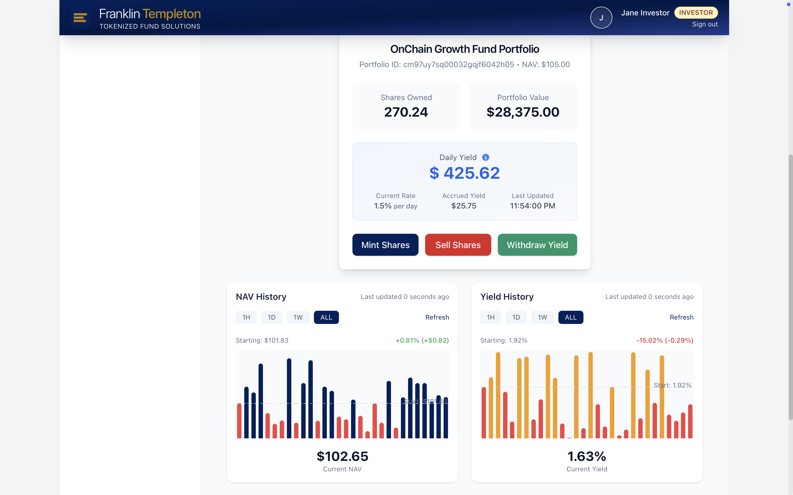
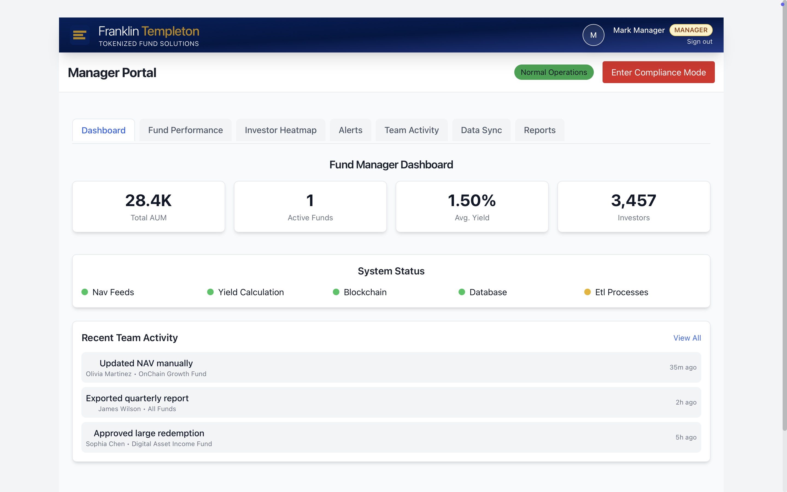
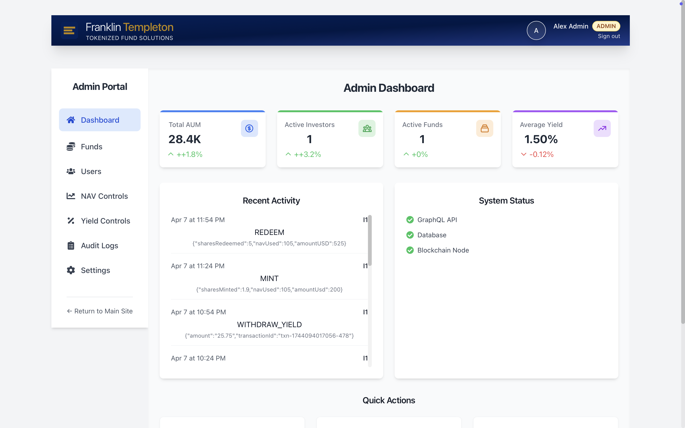

# 💼 Tokenized Fund Dashboard

A modern platform that brings tokenized investment funds into the digital age. Real-time NAV tracking, yield calculations, and a seamless investment experience all in one place!

## 📸 Screenshots

**Investor Portal**  
Live NAV tracking, portfolio overview, and seamless share transactions.



---

**Manager View**  
High-level fund metrics, system status, and recent team activity.



---

**Admin Portal**  
Full access to fund controls, audit logs, and platform health monitoring.



## 📺 Demo Video

[](https://youtu.be/WwcXMLcl3hM)

*Click the image above to watch the demo video*


## What's this all about?

This project combines the world of traditional finance with blockchain technology, providing a comprehensive dashboard for managing tokenized investment funds. It consists of:

- A powerful GraphQL API backend that handles all the fund data
- A slick React frontend that makes managing investments a breeze

## ✨ Key Features

- **Role-based Access**: Different views for Investors, Fund Managers, and Admins - everyone sees exactly what they need
- **Live Fund Monitoring**: Watch NAV changes and yield calculations update in real-time
- **Seamless Transactions**: Mint new shares or redeem existing ones with just a few clicks
- **Yield Management**: Track your earnings and withdraw yield when you're ready
- **Data Visualization**: Beautiful charts and analytics to understand performance at a glance
- **Full Audit Trail**: Complete history of all actions for transparency and compliance

## 🏗️ How It's Built

### Backend
- GraphQL API with Apollo Server for efficient data fetching
- Prisma ORM making database operations a breeze
- Secure JWT authentication with role-based permissions
- Smart resolvers that handle complex fund calculations

### Frontend
- React + Vite for a lightning-fast development experience
- Apollo Client for seamless GraphQL integration
- Chart.js creating beautiful visualizations of your data
- Tailwind CSS for a responsive design that looks great on any device

## 🚀 Getting Started

### What You'll Need
- Node.js (v16+)
- npm or yarn
- SQLite or PostgreSQL

### Setup in 5 Easy Steps

1. Clone the repo:
```
git clone https://github.com/yourusername/tokenized-fund-dashboard.git
cd tokenized-fund-dashboard
```

2. Install the dependencies:
```

cd tokenized-fund-dashboard
npm install
```

> ⚠️ **Note:** This project contains two separate folders with the same name:
>
> - The **root folder** (`tokenized-fund-dashboard/`) contains the **backend** (GraphQL server + Prisma).
> - Inside it, the **`tokenized-fund-dashboard/` subfolder** contains the **frontend** (React + Vite).
>
> Be sure you’re in the correct folder for each step.

3. Set up your environment:
```
 Frontend (React Dashboard)
Navigate into the frontend directory and copy the example environment file:
cd tokenized-fund-dashboard
cp .env.example .env
# Now edit .env with your database credentials and other settings
```

4. Initialize your database:
```
Run the following from the **project root**, where your `prisma/` folder is located:
npx prisma migrate dev
npx prisma db seed
```

5. Fire up the servers:

Backend:
```
(GraphQL + Prisma)
From the **project root**, start the backend server:
npm run dev
This runs the GraphQL API on `http://localhost:4000/graphql` by default.
If everything is set up correctly, you should see:
🚀 Server ready at http://localhost:4000/graphql
 **Troubleshooting:**  
 If you run into a `Cannot find module './common'` error from `debug` or `nodemon`, try:
 rm -rf node_modules package-lock.json
 npm cache clean --force
 npm install
 npm run dev
This will reset your environment and fix any broken dependencies.
```

6. Frontend:
```
tokenized-fund-dashboard/         ← backend lives here
└── tokenized-fund-dashboard/     ← frontend lives here (React + Vite)

cd tokenized-fund-dashboard
npm install
npm run dev
```

## 🚀 Deployment

When you're ready to go live:

Backend:
```
npm start
```

Frontend:
```
cd tokenized-fund-dashboard
npm run build
```

## 📝 License

MIT License - do awesome things with this code!
